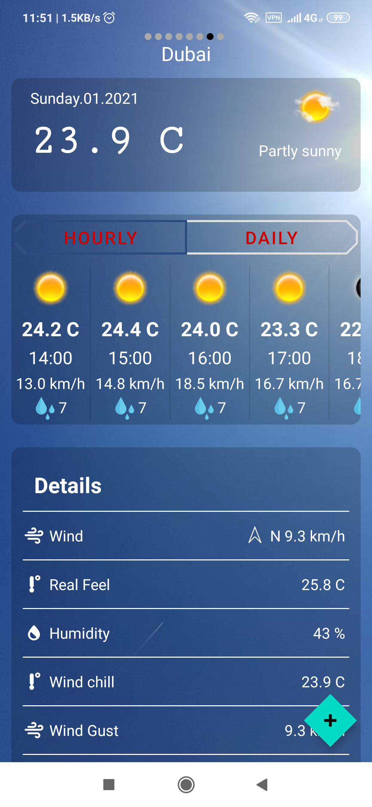
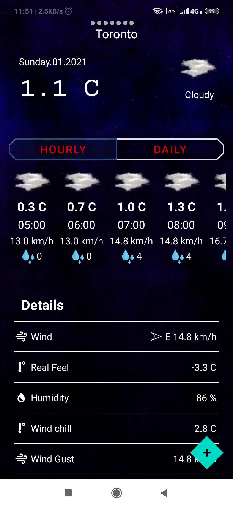
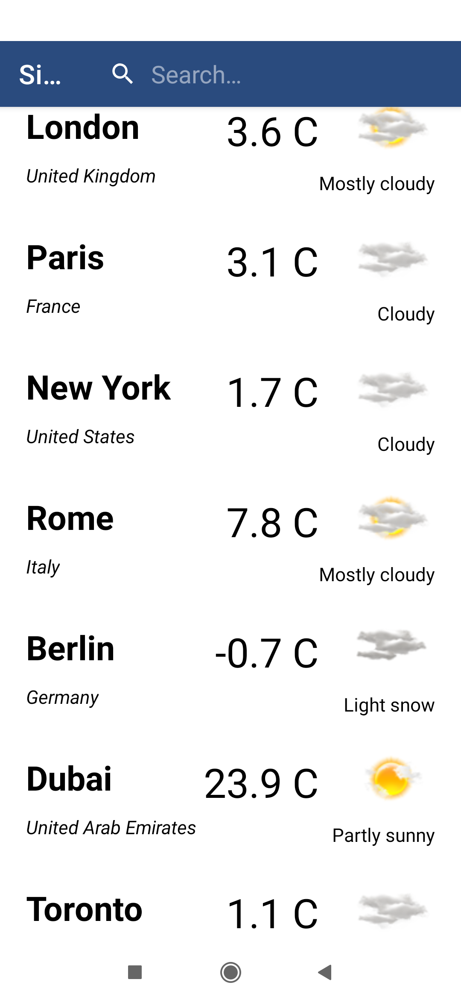
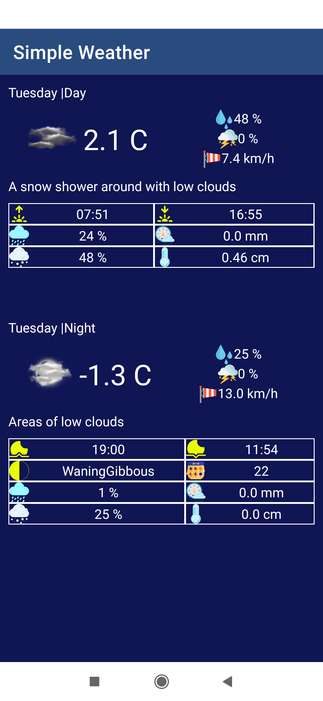
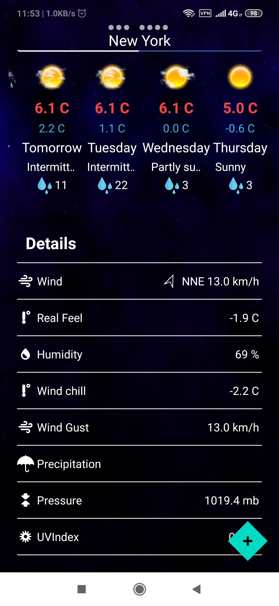

# Simple Weather
SimpleWeather is an android application for getting information about weather,
and it is implemented in MVVM Architecture pattern and using java.

## Features
User can do following:
-Display weather information according to their geographic locations.
-Search and add many cities(provided by the accuweather api) they want to get thier weather information.
-Display weather information by day(5 days) and by hour(12 hours).


### Libraries

- Uses **retrofit2** for making http requests.
- Uses **room** library for cached data.
- Uses **google play services** for obtain user location.

### API keys

You need to supply API key for the accuweather service the app uses.

- [accuweather](https://developer.accuweather.com/)

Once you obtain the key, you can set it in your `~/gradle.properties`:

```
API_KEY=insert your key
```

### media
 



